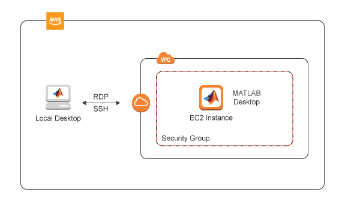

# MATLAB on Amazon Web Services

## Requirements
-   A MATLAB® license that is current on Software
    Maintenance Service (SMS). For more information, see [Configure MATLAB Licensing on the Cloud](http://www.mathworks.com/support/cloud/configure-matlab-licensing-on-the-cloud.html).
-   An Amazon Web Services™ (AWS) account.
-   An SSH Key Pair for your AWS account in the US East (N. Virginia) region. For more information, see [Amazon EC2 Key Pairs](https://docs.aws.amazon.com/AWSEC2/latest/UserGuide/ec2-key-pairs.html).

## Costs
You are responsible for the cost of the AWS services used when you create a cluster using this guide. Resource settings, such as instance type, will affect the cost of deployment. For cost estimates, see the pricing pages for each AWS service you will be using. Prices are subject to change.

## Introduction

The following guide will help you automate the process of running the MATLAB desktop on Amazon Web Services and connect to it using the Remote Desktop Protocol (RDP). The automation is accomplished using an AWS CloudFormation template. The template is a JSON file that defines the resources needed to run MATLAB on AWS. For information about the architecture of this solution, see [Architecture and Resources](#architecture-and-resources). For information about templates, see [AWS CloudFormation Templates](https://docs.aws.amazon.com/AWSCloudFormation/latest/UserGuide/template-guide.html).

## Prepare your AWS Account

1. If you don't have an AWS account, create one at https://aws.amazon.com by following the on-screen instructions.
2. Use the regions selector in the navigation bar to choose the **US-EAST (N. Virginia)** region where you want to deploy MATLAB.
3. Create a [key pair](https://docs.aws.amazon.com/AWSEC2/latest/UserGuide/ec2-key-pairs.html) in that region.  The key pair is necessary as it is the only way to connect to the instance as an administrator.
4. If necessary, [request a service limit increase](https://console.aws.amazon.com/support/home#/case/create?issueType=service-limit-increase&limitType=service-code-) for the Amazon EC2 instance type or VPCs.  You might need to do this if you already have existing deployments that use that instance type or you think you might exceed the [default limit](http://docs.aws.amazon.com/AWSEC2/latest/UserGuide/ec2-resource-limits.html) with this deployment.

# Deployment Steps

## Step 1. Launch the Template

Click the **Launch Stack** button to deploy a standalone MATLAB desktop client on AWS. This will open the CloudFormation Create Stack screen in your web browser.

| Release | Ubuntu 16.04 VM |
|---------------|------------------------|-----------------|
| MATLAB R2018b |   |
For other releases, see [How do I launch a template that uses a previous MATLAB release?](#how-do-i-launch-a-template-that-uses-a-previous-matlab-release)

**Note**: Creating a stack on AWS can take a few minutes.

## Step 2. Configure the Stack
1. Provide values for parameters in the Create Stack page:

    | Name                           | Value                                                                                                                                                                                                                                                                                                                                                                                                                                                                                                                                                                                                |
    |--------------------------------|------------------------------------------------------------------------------------------------------------------------------------------------------------------------------------------------------------------------------------------------------------------------------------------------------------------------------------------------------------------------------------------------------------------------------------------------------------------------------------------------------------------------------------------------------------------------------------------------------|
    | **Stack name**                 | Choose a name for the stack. This will be shown in the AWS console. This must be unique within an AWS account. 
<em>Example</em>: Boston
                                                                                                                                                                                                                                                                                                                                                                                                                                                                            |
    | **AWS EC2 Instance type**      | Choose the AWS instance type to use for running MATLAB. Check to ensure the instance type is available as not all types are available in all regions. For more information, see [Amazon EC2 Instance Types](https://aws.amazon.com/ec2/instance-types/) and [Pricing](https://aws.amazon.com/ec2/pricing/on-demand/). 
<em>Example</em>: m5.xlarge
                                                                                                                                                                                                                                                             |
    | **MATLAB AMI**                 | This is the image prepared by MathWorks which contains MATLAB 2018a pre-installed running on Ubuntu 16.04 and pre-configured drivers. If you've created your own custom image you can enter your AMI ID here. 
<em>Example</em>: my-matlab-ami
                                                                                                                                                                                                                                                                                                                                                                |
    | **Allow RDP connections from** | This is the IP address range that will be allowed to connect to this instance using the Remote Desktop Protocol. The format for this field is IP Address/Mask. 
<em>Example</em>: 
10.0.0.1/32 <ul><li>This is the public IP address which can be found by searching for "what is my ip address" on the web. The mask determines the number of IP addresses to include.</li><li>A mask of 32 is a single IP address.</li><li>Use a [CIDR calculator](https://www.ipaddressguide.com/cidr) if you need a range of more than one IP addresses.</li><li>You may need to contact your IT administrator to determine which address is appropriate.</li></ul>
 |
    | **SSHKeyName**                 | A valid SSH key pair from AWS used to SSH into the instance. This is the only way to perform sudo operations on the instance itself. 
<em>Example</em>: my-keypair
                                                                                                                                                                                                                                                                                                                                                                                                                                                      |
	| **Username**					 | Enter a username you would like to use to connect to the virtual machine in the cloud using remote desktop.																																																																																																																																						|
	| **Password**					 | Enter a password you would like to use to connect to the virtual machine in the cloud using remote desktop.																																																																																																																																							|
	| **Confirm Password**			 | Retype the password to confirm. 																																																																																																																																					|

    >**Note**: Make sure you select US East (N.Virginia) as your region from the nagivation panel on top. Currently, this is the only supported region. 
    
2. Click the **Create** button.  The CloudFormation service will start creating the resources for the stack. 
After clicking **Create** you will be taken to the *Stack Detail* page for your stack. Wait for the Status to reach **CREATE\_COMPLETE**. This may take up to 10 minutes.
  

## Step 3. Connect to the Virtual Machine in the Cloud

1. Expand the **Outputs** section in the the *Stack Detail* page.
1. Look for the key named `RDPConnection` and copy the corresponding public DNS name listed under value. *For example*: ec2-11-222-33-44.compute-1.amazonaws.com
1. Launch any remote desktop client, paste the public DNS name in the appropriate field, and connect. On the Windows Remote Desktop Client you need to paste the public DNS name in the **Computer** field and click **Connect**.
1. In the login screen that's displayed, use the username and password you specified while setting up the stack in [Step 2](#step-2-configure-the-stack).

## Step 4. Launch MATLAB
Double-click the MATLAB icon on the virtual machine desktop to launch MATLAB. The first time you start MATLAB you will need to activate it. By default you will be asked to use your MathWorks Account to activate MATLAB. For other ways to activate MATLAB, see [Configure MATLAB Licensing on the Cloud](http://www.mathworks.com/support/cloud/configure-matlab-licensing-on-the-cloud.html).

>**Note**:It may take a few minutes for activation to complete and MATLAB to start. You will experience this delay only the first time you start MATLAB. 

# Additional Information

## Delete Your Stack

Once you have finished using your stack, it is recommended that you delete all resources to avoid incurring further cost. To delete the stack, do the following:
1. Log in to the AWS Console.
1. Go to the AWS CloudFormation page and select the stack you created.
1. Click the **Actions** button and click **Delete Stack** from the menu that appears.

## Architecture and Resources

Deploying this reference architecture sets up a single AWS EC2 instance containing Linux and MATLAB, a private VPC with an internet gateway, a private subnet and a security group that opens the appropriate ports for SSH and RDP access.  

To make deployment easy we have prepared an Amazon Machine Image (AMI) running Ubuntu 16.04 with pre-installed drivers. The AMI contains the following software:
* MATLAB, Simulink, Toolboxes, and support for GPUs.
* Add-Ons: Neural Network Toolbox Model for AlexNet Network, Neural Network Toolbox Model for GoogLeNet Network, and Neural Network Toolbox(TM) Model for ResNet-50 Network

The AMI is currently available in the US East region only. 

### Resources

The following resources will be created as part of the CloudFormation Stack.  

1. VPC w/Internet Gateway
1. Subnet
1. Security Group for SSH and RDP access
1. EC2 Instance

## FAQ
### How do I launch a template that uses a previous MATLAB release?
| Release | Ubuntu 16.04 VM |
|---------------|------------------------|-----------------|
| MATLAB R2018a |  |

### How do I save my changes in the VM?
All your files and changes are stored locally on the virtual machine.  They will persist until you either terminate the virtual machine instance or delete the stack.  Stopping the instance does not destroy the data on the instance.  If you want your changes to persist  outside the stack or before you terminate an instance you’ll need to:
* copy your files to another location (*Example*: S3 or Mount an Amazon EBS volume and create a snapshot), or  
* create an image of the virtual machine. 

### What happens to my data if I shutdown the instance?
You may want to shutdown the instance when you aren’t using it to save some money (you only pay for the storage used by the virtual machine when it is stopped).  To shutdown an EC2 instance, locate it in the AWS web console, select the instance and choose “Instance State/Stop” from the “Actions” menu.  You can restart it from the same menu.  Any files or changes made to the virtual machine will persist when shutting down and will be there when you restart.  A side-effect of shutting down the virtual machine and restarting is that the public IP address and DNS name may change.  Inspecting the EC2 instance in the AWS console will reveal the new IP address and DNS name.
### How do I keep the same public IP address?
To avoid having to change the IP address between restarts you can establish a static IP using AWS Elastic IP Address. For more information, see https://docs.aws.amazon.com/AWSEC2/latest/UserGuide/elastic-ip-addresses-eip.html.
### How do I save a VM image?
To save a VM image, locate the EC2 Instance in the AWS web console and from the "Actions" menu select the instance and choose “Image/Create Image”.  
### How do I customize the VM image?
You can customize a VM image by launching the reference architecture, applying any changes you want to the EC2 Instance such as installing additional software, drivers and files and then saving an image of that instance using the AWS Console. For more information, see [How Do I save a VM image?](#how-do-i-save-a-vm-image). When creating a stack, replace the AMI ID in the CloudFormation template with the AMI ID of your custom image.
### How do I use a different license manager? 
The VM image uses MathWorks Hosted License Manager by default.  For information on using other license managers, see [Configure MATLAB Licensing on the Cloud](http://www.mathworks.com/support/cloud/configure-matlab-licensing-on-the-cloud.html). 
### How do I deploy this reference architecture to an existing VPC?
In the `templates` folder of this repository you will find an example template for launching the reference architecture within an existing VPC and subnet. Edit the template to deploy this reference architecure to an existing VPC. 

# Enhancement Request
Provide suggestions for additional features or capabilities using the following link: https://www.mathworks.com/cloud/enhancement-request.html

# Technical Support
Email: `cloud-support@mathworks.com`