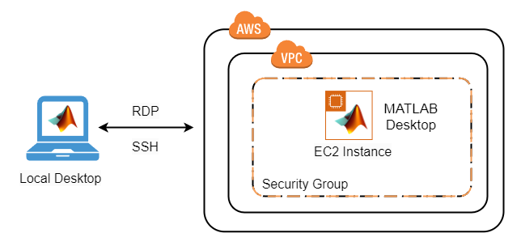

# MATLAB on Amazon Web Services

## Requirements
Before starting, you will need the following:
-   A MATLAB® license that is current on Software
    Maintenance Service (SMS). For more information, see [Configure MATLAB Licensing on the Cloud](https://www.mathworks.com/help/licensingoncloud/matlab-on-the-cloud.html.).
-   An Amazon Web Services™ (AWS) account.
-   An SSH Key Pair for your AWS account in the appropriate region. For more information, see [Amazon EC2 Key Pairs](https://docs.aws.amazon.com/AWSEC2/latest/UserGuide/ec2-key-pairs.html).

## Costs
You are responsible for the cost of the AWS services used when you create a cluster using this guide. Resource settings, such as instance type, will affect the cost of deployment. For cost estimates, see the pricing pages for each AWS service you will be using. Prices are subject to change.

## Introduction

The following guide will help you automate the process of running the MATLAB desktop on Amazon Web Services and connect to it using the Remote Desktop Protocol (RDP). The automation is accomplished using an AWS CloudFormation template. The template is a JSON file that defines the resources needed to run MATLAB on AWS. For information about the architecture of this solution, see [Architecture and Resources](#architecture-and-resources). For information about templates, see [AWS CloudFormation Templates](https://docs.aws.amazon.com/AWSCloudFormation/latest/UserGuide/template-guide.html).

## Prepare your AWS Account

1. If you don't have an AWS account, create one at https://aws.amazon.com by following the on-screen instructions.
2. Use the regions selector in the navigation bar to choose the **US East (N. Virginia)** or **EU (Ireland)** region where you want to deploy MATLAB.
3. Create a [key pair](https://docs.aws.amazon.com/AWSEC2/latest/UserGuide/ec2-key-pairs.html) in that region.  The key pair is necessary as it is the only way to connect to the instance as an administrator.
4. If necessary, [request a service limit increase](https://console.aws.amazon.com/support/home#/case/create?issueType=service-limit-increase&limitType=service-code-) for the Amazon EC2 instance type or VPCs.  You might need to do this if you already have existing deployments that use that instance type or you think you might exceed the [default limit](http://docs.aws.amazon.com/AWSEC2/latest/UserGuide/ec2-resource-limits.html) with this deployment.

# Choose a Deployment Option

- [Deploy MATLAB on AWS using Online Licensing](online-licensing-instructions.md)
- [Deploy MATLAB on AWS using Network Licensing](license-manager-instructions.md)

## Architecture and Resources

Deploying this reference architecture sets up a single AWS EC2 instance containing Linux and MATLAB, a private VPC with an internet gateway, a private subnet and a security group that opens the appropriate ports for SSH and RDP access.  

To make deployment easy we have prepared an Amazon Machine Image (AMI) running Ubuntu 16.04 with pre-installed drivers. The AMI contains the following software:
* MATLAB, Simulink, Toolboxes, and support for GPUs.
* Add-Ons: Neural Network Toolbox Model for AlexNet Network, Neural Network Toolbox Model for GoogLeNet Network, and Neural Network Toolbox(TM) Model for ResNet-50 Network

The AMI is currently available in the US East (N. Virginia) and EU West (Ireland) regions only. 

### Resources

The following resources will be created as part of the CloudFormation Stack.  

1. VPC w/Internet Gateway
1. Subnet
1. Security Group for SSH and RDP access
1. EC2 Instance

# Enhancement Request
Provide suggestions for additional features or capabilities using the following link: https://www.mathworks.com/cloud/enhancement-request.html

# Technical Support
Email: `cloud-support@mathworks.com`
